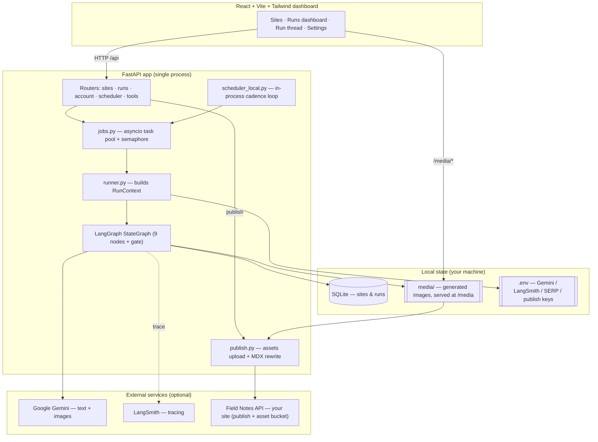
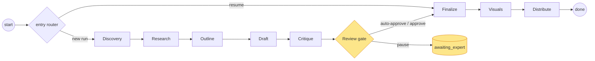
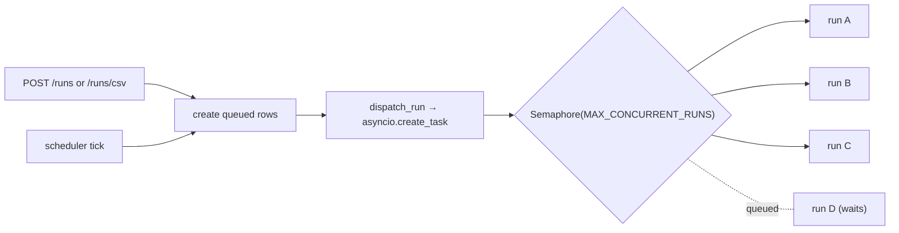
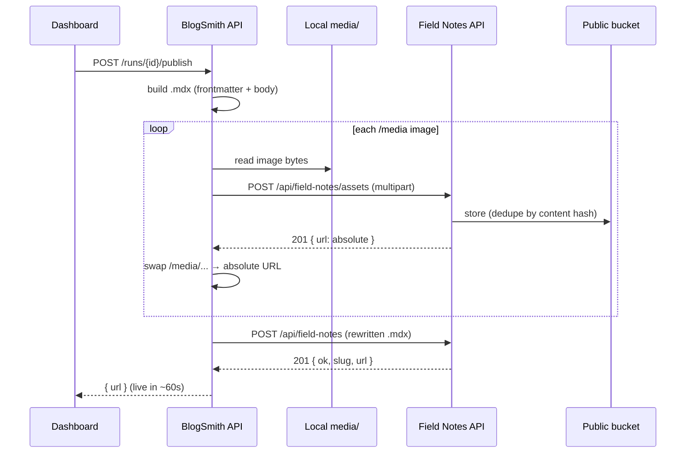
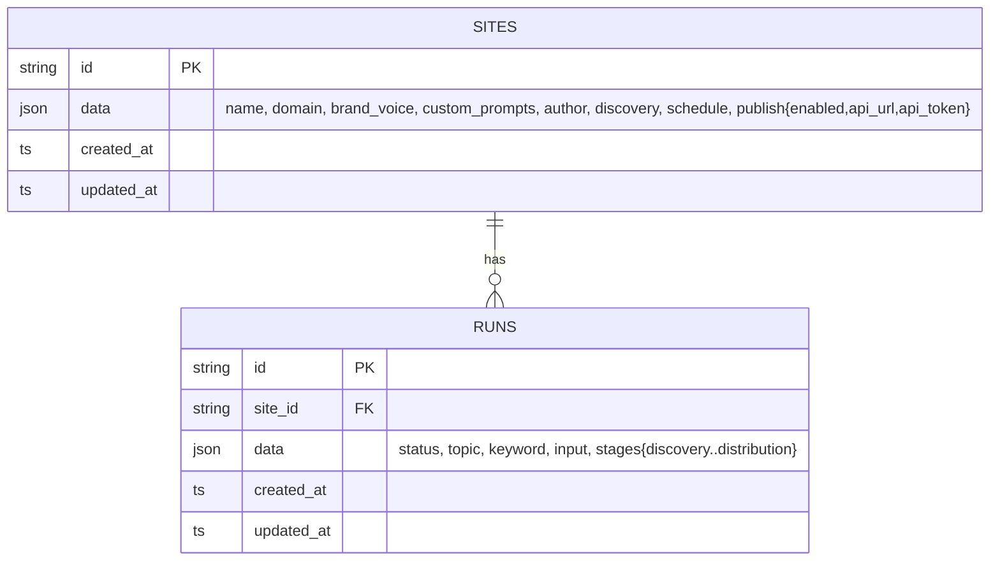

# BlogSmith — A Local Agentic Blogging Service

**One local dashboard that researches, writes, illustrates, reviews, and publishes
human, SEO-strong blog posts for all of your websites — driven by a 9-stage
LangGraph agent with a human-expert review gate, shown as a live run thread.**

Runs entirely on your machine: a **SQLite** database, a local **media** folder for
generated images, API keys from **`.env`**. No cloud, no auth, no Firebase. When a
post is ready it can publish itself — images and all — to your live site over HTTP.

| | |
|---|---|
| **Dashboard** | `http://localhost:5173` (dev) · `http://localhost:8000` (served by the API) |
| **Swagger** | `http://localhost:8000/docs` |
| **Stack** | FastAPI · LangGraph · Google Gemini · React + Vite + Tailwind · SQLite |

---

## Table of contents

- [What it does](#what-it-does)
- [System architecture](#system-architecture)
- [The pipeline](#the-pipeline)
- [Run lifecycle](#run-lifecycle)
- [Concurrency model](#concurrency-model)
- [Publishing flow](#publishing-flow)
- [Data model](#data-model)
- [Run it locally](#run-it-locally)
- [Configuration](#configuration)
- [API surface](#api-surface)
- [Repository map](#repository-map)
- [Testing](#testing)
- [Design notes](#design-notes)

---

## What it does

- **9-stage LangGraph pipeline** — `Discovery → Research → Outline → Draft → Critique →
  [review gate] → Finalize → Visuals → Distribute`, one clean LangSmith trace per phase.
- **Human review gate** — the run pauses at `awaiting_expert` (the SQLite row is the durable
  checkpoint) and shows **approve / edit / reject** in the dashboard; approve resumes
  Finalize → Visuals → Distribute.
- **Story-driven writing** — authored system prompts push the model to write like a
  practitioner telling a story (hook, concrete examples, vivid specifics, full-circle close),
  not a generic "company blog". Each site layers its own brand voice + per-stage prompts on top.
- **Gemini image generation** — the Visuals stage renders each planned diagram/photo to the
  local media folder; diagrams fall back to **Mermaid** when image generation is unavailable.
- **MDX output** — finished posts assemble into `.mdx` with YAML frontmatter (title,
  description, dates, author, tags, type) ready for your site.
- **Runs dashboard** — a transaction-style table: search, status + date filters, sorting,
  pagination, row selection with **bulk** approve / publish / download / cancel, and
  per-run icon actions. Cancel any run mid-flight.
- **Concurrent execution** — many blogs run in parallel (capped by `MAX_CONCURRENT_RUNS`);
  each blog's images generate concurrently.
- **One-click publish with hosted images** — push a finished post to your site's Field Notes
  API: each local image is uploaded to the site's bucket first, the MDX is rewritten to the
  returned absolute URLs, then the post is published. Configured **per site** (each app can
  target a different endpoint/token) or globally via `.env`.
- **CSV in/out** — download/edit/upload a site's config as CSV (name + domain locked), and
  bulk-queue many topics from one CSV (staged — nothing runs until you click *Generate*).
- **Local scheduler** — an in-process loop fires due cadences (e.g. *10 blogs, 9am daily*).
- **Heuristic-first, degrades gracefully** — no SERP key → autocomplete discovery; no
  LangSmith → no tracing; no image key → Mermaid; SEO score is deterministic. Gemini (text)
  is the only hard dependency.

---

## System architecture



**One process, one event loop.** FastAPI serves the API, the built dashboard, and the
`/media` images. Runs execute as `asyncio` tasks on the same loop (not request-blocking
background tasks), so the API stays responsive and many blogs progress at once.

---

## The pipeline

A single compiled LangGraph `StateGraph` serves both phases via a conditional entry point.
Phase A runs to the gate and pauses; Phase B re-enters at Finalize after the human decision.



| Stage | What it does |
|---|---|
| **Discovery** | Ranks topic candidates by buyer intent (seed topics + autocomplete; GSC/SERP stubs). |
| **Research** | Gathers facts with a primary-source bias; separates verified from unverified. |
| **Outline** | Structures to search intent + the site's pillar/cluster map; plans a story-driven open and a real conclusion. |
| **Draft** | Writes the full Markdown in brand voice with `[[IMAGE: …]]` placeholders. *(Needs a Gemini key.)* |
| **Critique** | Strips fluff, kills AI tells, flags claims, runs the SEO checklist. |
| **Review gate** | Pauses the run; you approve / edit / reject in the dashboard thread. |
| **Finalize** | Title, meta, slug, tags, type, JSON-LD (real dates + site author), image prompts. |
| **Visuals** | Generates each image with Gemini → local media folder → embeds it (concurrently); Mermaid fallback. |
| **Distribute** | Repurposes the post into a LinkedIn thread. |

The per-blog `RunContext` carries the live model clients + site config; after each stage it
writes a JSON slice + status to the run's SQLite row, so the dashboard shows live progress
and the row doubles as the resume checkpoint.

---

## Run lifecycle

```mermaid
stateDiagram-v2
    [*] --> queued
    queued --> discovering
    discovering --> researching --> outlining --> drafting --> critiquing
    critiquing --> awaiting_expert: review gate
    critiquing --> finalizing: auto-approve
    awaiting_expert --> finalizing: approve / edit
    awaiting_expert --> rejected: reject
    finalizing --> generating_images --> distributing --> done

    queued --> cancelled: cancel
    discovering --> cancelled: cancel
    awaiting_expert --> cancelled: cancel
    drafting --> failed: error

    done --> [*]
    rejected --> [*]
    cancelled --> [*]
    failed --> [*]
```

Terminal states: `done`, `rejected`, `cancelled`, `failed`. Cancel works whether a run is
queued, executing, or paused at the gate — the live `asyncio` task is cancelled and the row
is stamped `cancelled`.

---

## Concurrency model



Runs are scheduled on the event loop and gated by a semaphore (default **3**), so a CSV of
20 topics drains N-at-a-time instead of one-by-one. Within a single blog, the Visuals stage
generates all images with `asyncio.gather` rather than serially.

---

## Publishing flow

Publishing a finished post hosts its images first (the Field Notes API rejects relative
`/media` paths), rewrites the MDX to the absolute URLs, then posts the document.



The target is resolved **per site first** (Site → Config → *Publishing*), then falls back to
the global `.env` default. Tokens are stored locally and returned masked. See
`docs/field-notes-api.md` for the endpoint contract.

---

## Data model

SQLite, two tables; documents are JSON blobs with overlaid `id`/timestamps.



Generated images live on disk at `media/{site_id}/{run_id}/img-{n}.{ext}` and are served
under `/media`.

---

## Run it locally

**One-time setup**

```bash
python3 -m venv .venv && . .venv/bin/activate
pip install -r requirements.txt
cp .env.example .env          # add your GEMINI_API_KEY

cd frontend && npm install && cd ..
```

**Run both servers (one command)**

```bash
./dev.sh
#   → http://localhost:5173   dashboard (Vite dev server, hot reload)
#   → http://localhost:8000   API + Swagger at /docs
```

No login. The first run creates `blogsmith.db` and a `media/` folder.

**Other commands**

```bash
# Full pipeline end-to-end without a server (fakes if no Gemini key is set):
python scripts/demo_run.py --topic "DPDPA compliance checklist for SaaS"

# Correctness gates
ruff check blogsmith tests
pytest -q
```

---

## Configuration

All via `.env` (see `.env.example`). Everything has a working local default.

| Variable | Default | Purpose |
|---|---|---|
| `GEMINI_API_KEY` | — | **Required.** Text + image generation. |
| `LANGSMITH_API_KEY` | — | Optional. One trace per phase. |
| `SERP_API_KEY` | — | Optional. Paid discovery sources. |
| `DB_PATH` | `blogsmith.db` | SQLite file. |
| `IMAGES_DIR` | `media` | Generated-image folder (served at `/media`). |
| `TEXT_MODEL` | `gemini-2.0-flash` | Text model. |
| `IMAGE_MODEL` | `gemini-2.0-flash-exp-image-generation` | Image model. |
| `MAX_CONCURRENT_RUNS` | `3` | How many blogs execute at once. |
| `SCHEDULER_ENABLED` | `true` | Run the in-process cadence scheduler. |
| `SCHEDULER_INTERVAL_SECONDS` | `60` | Scheduler tick interval. |
| `PUBLISH_ENABLED` | `false` | Global publishing fallback (per-site config overrides). |
| `FIELD_NOTES_URL` | Tessera prod URL | Global publish endpoint. |
| `FIELD_NOTES_TOKEN` | — | Global bearer token. |

Per-site publishing (a different endpoint/token per app) is set in the dashboard under
**Site → Config → Publishing**, and takes precedence over the global values.

---

## API surface

18 paths (full spec in `openapi.json`, live at `/docs`). Highlights:

```
GET    /health                              live integration status
GET    /account                             provider-key + publish status (masked)

POST   /sites                               create a site
GET    /sites                               list sites
GET    /sites/{id}                          get a site (publish token masked)
PATCH  /sites/{id}                          update config (incl. per-site publish target)
DELETE /sites/{id}                          delete a site
GET    /sites/{id}/config.csv               download config as CSV
POST   /sites/{id}/config-csv               import config CSV (name/domain locked)

POST   /sites/{id}/runs                     create one run
POST   /sites/{id}/runs/csv                 bulk-queue runs from a topics CSV
GET    /sites/{id}/runs                     list runs (id, status, topic, timestamps, stages)
GET    /sites/{id}/runs/template.csv        bulk-topics CSV template
GET    /sites/{id}/runs/{rid}               run status + stage slices
POST   /sites/{id}/runs/{rid}/decision      approve / edit / reject (gate)
POST   /sites/{id}/runs/{rid}/cancel        cancel a run mid-flight
POST   /sites/{id}/runs/{rid}/publish       host images + publish the .mdx
GET    /sites/{id}/runs/{rid}/result        publishable output (.mdx, tags, images, thread)

POST   /scheduler/tick                      fire due cadences now
POST   /tools/discover · /tools/preview-image
```

---

## Repository map

```
blogsmith/
  api/
    main.py            app factory; init SQLite, mount /media, start scheduler, serve dashboard
    jobs.py            concurrent run dispatch (asyncio + semaphore) + cancel
    routers/
      account.py       provider-key + publish status (read-only)
      sites.py         CRUD + custom prompts + schedule + per-site publish + config CSV
      runs.py          create / status / result(.mdx) / decision / cancel / publish + bulk CSV
      scheduler.py     POST /scheduler/tick
      tools.py         /health, /tools/discover, /tools/preview-image
  graph/               THE INTELLIGENCE LAYER
    blog_graph.py      StateGraph wiring + run/resume (conditional entry; gate)
    nodes.py           9 stage nodes
    context.py         RunContext (live clients + per-stage persistence)
    state.py model.py image_model.py checkpoint.py
  prompts/             authored default system prompts per stage + assembly (PROMPT_VERSION)
  discovery.py research.py outline.py draft.py critique.py finalize.py visuals.py distribute.py
  store.py             SQLite persistence (sites/runs)
  storage.py           local image storage (served at /media)
  publish.py           Field Notes publish + asset upload + MDX rewrite
  scheduler_local.py   in-process cadence scheduler
  accounts.py seo.py schedule.py runner.py csv_io.py mdx.py markdown_utils.py config.py models.py schemas.py

frontend/              React + Vite + Tailwind dashboard (no login)
  src/components/       SiteDetail · RunsPanel (dashboard) · RunThread · Settings
scripts/               demo_run.py, export_openapi.py
docs/                  field-notes-api.md, bloggs-guide.md
tests/                 per-stage / pipeline / gate-resume / CSV / publish tests
```

---

## Testing

```bash
ruff check blogsmith tests scripts   # lint
pytest -q                            # 42 tests: stages, pipeline, gate resume, CSV,
                                     #   cancel, per-site publish, asset upload/rewrite
cd frontend && npx tsc --noEmit      # frontend typecheck
python scripts/export_openapi.py     # regenerate openapi.json
```

Tests run against a throwaway SQLite file and fake Gemini clients — no network, no keys,
and isolated from any real publishing config in your `.env`.

---

## Design notes

- **Single local workspace, no auth** — anyone with access to the machine has access. Don't
  expose the port publicly without putting your own auth in front.
- **Keys live in `.env`** and per-site tokens live in the local DB (returned masked, never
  shipped raw). Publishing never fires unless a token is explicitly resolved.
- **Heuristic-first** — the pipeline degrades gracefully when optional services are absent,
  so you can run the whole thing with just a Gemini key.
```
