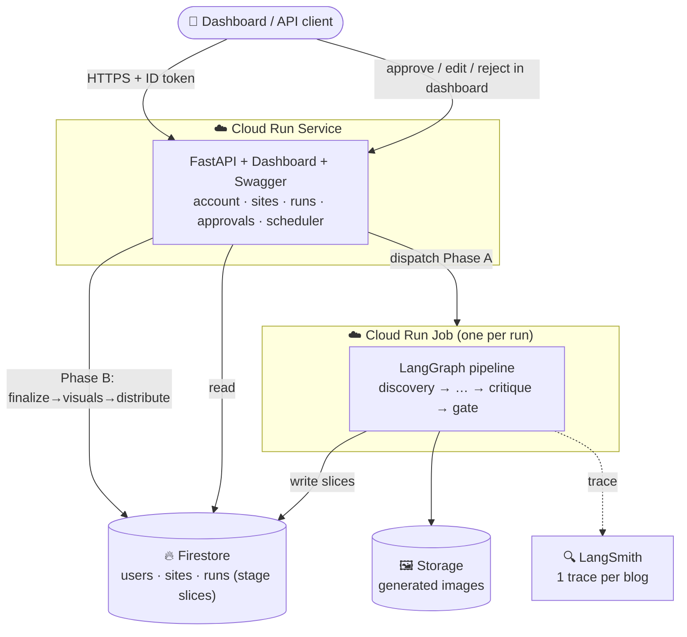

# BlogSmith — A Production-Grade Agentic Blogging Service

**One authenticated dashboard that researches, writes, illustrates, and distributes
human-like, SEO-strong blog posts for all of your websites — with a non-negotiable
human-expert review gate, shown as a live LangSmith-style run thread.**

| | |
|---|---|
| **Dashboard** | `http://localhost:8000/` |

Users interact entirely through the **dashboard**. The HTTP layer exists only to back
it (Swagger is available at `/docs` for debugging, but it is not the product surface).

---

## Abstract

BlogSmith is a multi-tenant content engine behind a single API + dashboard. A user
authenticates (Firebase Auth), stores their own **Gemini API key** and **custom prompts**
per website, and sets a cadence (e.g. *10 blogs, 9am daily*). For each blog, a **9-stage
LangGraph agent pipeline** discovers a buyer-intent topic, researches it against primary
sources, outlines it to search intent, drafts it in the site's brand voice, edits it,
**emails the draft for a human expert pass**, then finalizes SEO metadata, **generates
images with Gemini** (graphs/flowcharts/photos), and repurposes the post into a LinkedIn
thread. Every stage degrades gracefully when an optional integration is missing, and the
whole thing runs locally with zero cloud infrastructure.

---

## Highlights

- **9-stage LangGraph pipeline** — `Discovery → Research → Outline → Draft → Critique →
  [human review gate] → Finalize → Visuals → Distribute`, one clean LangSmith trace per blog.
- **LangSmith-style run thread** — the dashboard shows each blog as a live vertical timeline:
  which stage is running, each stage's output expandable, with the review gate inline.
- **In-dashboard review gate** — at the gate the run pauses (the Firestore document is the
  durable checkpoint) and shows **approve / edit / reject** right in the thread; approve/edit
  resumes finalize → visuals → distribute. No email.
- **The prompts are the product** — authored, versioned default system prompts for every
  stage (anti-AI-tell writing rules, SEO checklist, source discipline) that each user layers
  their own **per-domain custom prompts** and brand voice on top of.
- **Gemini image generation** — the Visuals stage renders each planned image and embeds it
  with alt text; diagrams fall back to **Mermaid** when image generation is unavailable.
- **BYOK, encrypted** — users bring their own Gemini (and optional LangSmith/SERP/SendGrid)
  keys; everything is encrypted at rest (Fernet) and never enters the graph checkpoint.
- **Heuristic-first, degrades gracefully** — no SERP key → autocomplete discovery; no
  LangSmith → no tracing; no image key → Mermaid; SEO score is fully deterministic. The
  writer (Gemini) is the only hard dependency, and it fails *loudly*, never with an empty post.
- **Scheduling that scales** — one Cloud Scheduler cron hits `/scheduler/tick`, which fans
  out due cadences across all sites; no per-user cron sprawl.
- **Local-first** — runs entirely against the Firebase emulator (or the in-memory test fake);
  the React dashboard is served by FastAPI.

---

## Tech stack

| Layer | Technology |
|---|---|
| **API** | FastAPI + Pydantic v2 — auto Swagger at `/docs` |
| **Agent orchestration** | LangGraph state graph (`discovery → … → distribute`) |
| **LLM** | Google Gemini via `langchain-google-genai` (pluggable) |
| **Images** | Gemini image generation via `google-genai`; Mermaid fallback |
| **Observability** | LangSmith — one trace per blog |
| **Auth + DB** | Firebase Auth + Firestore (central project) |
| **Image storage** | Firebase Storage |
| **Secrets** | Fernet-encrypted BYOK keys in Firestore; Secret Manager in prod |
| **Dashboard** | React 18 + Vite + Tailwind, served by FastAPI |
| **Hosting** | Cloud Run Service (API) + Cloud Run Job (run executor) + Cloud Scheduler |

---

## Architecture



The review gate splits execution into **Phase A** (discovery → gate, in the Job) and
**Phase B** (finalize → visuals → distribute, resumed when you act in the dashboard). The
same compiled graph serves both via a conditional entry point; state is rebuilt from the run
document, so a paused run survives any process restart.

---

## The pipeline

1. **Discovery** — ranks topic candidates (seed topics + Google autocomplete by default;
   GSC/SERP adapters behind the same interface) by buyer intent.
2. **Research** — gathers facts with a primary-source bias for regulatory topics; separates
   verified from unverified claims.
3. **Outline** — structures to search intent + the site's pillar/cluster map; plans internal
   links, visual placements, and the expert-insight slot.
4. **Draft** — writes the full Markdown in brand voice, weaving in the expert insight and
   emitting `[[IMAGE: …]]` placeholders. *(Requires a Gemini key.)*
5. **Critique** — a ruthless editor pass: strips fluff, kills AI tells, flags claims, runs the
   SEO checklist. Deterministic SEO score from `seo.py`; the model only narrates.
6. **Human review gate** — pauses the run; you approve/edit/reject in the dashboard thread.
7. **Finalize** — title, meta description, slug, JSON-LD schema, per-image generation prompts
   and alt text. The body is locked.
8. **Visuals** — generates each image with Gemini → Firebase Storage → embeds it; diagrams
   fall back to Mermaid, photos drop cleanly on failure.
9. **Distribute** — repurposes the post into a LinkedIn thread.

---

## Run it locally

Local dev uses your **real Firebase project** (Firestore + Auth) — no emulator, no Java.
The backend talks to Firestore via your gcloud Application Default Credentials.

**One-time setup**

```bash
# Python backend
python3 -m venv .venv && . .venv/bin/activate
pip install -r requirements.txt
cp .env.example .env              # set FIREBASE_PROJECT_ID + a KEY_ENCRYPTION_KEY

# Credentials for Firestore/Auth from your machine
gcloud auth application-default login
gcloud config set project <your-project-id>

# Frontend deps + Firebase web config
cd frontend && npm install && cd ..
#   put your Firebase web config in frontend/.env (VITE_FIREBASE_*)
```

**Run both servers (one command)**

```bash
./dev.sh
#   → http://localhost:5173   dashboard (Vite dev server, hot reload)
#   → http://localhost:8000   API + Swagger at /docs
```

The dashboard on :5173 proxies API calls to the backend on :8000; Firebase Auth runs in the
browser. Use the dashboard at **:5173** during development.

> Want to skip login while iterating? Set `AUTH_DISABLED=true` in `.env` and remove
> `frontend/.env` — the backend then uses a fixed dev user and the dashboard runs token-less.

**Other commands**

```bash
# Full pipeline end-to-end without a server (uses fakes if no Gemini key is set):
python scripts/demo_run.py --topic "DPDPA compliance checklist for SaaS"

# Correctness gates (in-memory Firestore fake — no cloud/Java needed)
ruff check blogsmith tests
pytest -q
```

When you're ready to host, see `deploy/README.md` for Cloud Run (the same Firebase project
backs both local and prod).

---

## Repository map

```
blogsmith/
  api/
    main.py            app factory, lifespan → Firebase init, serves dashboard + /docs
    auth.py            Firebase ID-token dependency (AUTH_DISABLED for dev)
    jobs.py            dispatch: Cloud Run Job (prod) | background task (dev)
    routers/
      account.py       BYOK provider keys (encrypted)
      sites.py         CRUD sites + per-site custom prompts + schedule
      runs.py          create run, status, result, review decision (approve/edit/reject)
      scheduler.py     POST /scheduler/tick (Cloud Scheduler)
      tools.py         /health, /tools/discover, /tools/draft, /tools/preview-image
  graph/               THE INTELLIGENCE LAYER
    blog_graph.py      StateGraph wiring + run/resume (conditional entry; gate)
    nodes.py           9 stage nodes (persist slice + advance status)
    state.py           channel-typed BlogState (no secrets)
    context.py         RunContext — live deps + Firestore persistence
    model.py           LlmClient + LlmBudget (graceful degradation)
    image_model.py     Gemini image gen + Mermaid fallback
    checkpoint.py      Firestore-as-checkpoint (state ↔ run doc)
  prompts/
    defaults.py        authored system prompts per stage + human-like rules + SEO checklist
    assemble.py        base + brand voice + per-site custom prompt layering (versioned)
  discovery.py research.py outline.py draft.py critique.py finalize.py visuals.py distribute.py
  seo.py               deterministic SEO scoring
  schedule.py          cadence → due-slot computation
  runner.py            build RunContext from Firestore; execute_run / execute_resume
  run_job.py           Cloud Run Job entrypoint
  firestore_db.py storage.py crypto.py accounts.py config.py models.py schemas.py markdown_utils.py

frontend/              React + Vite + Tailwind dashboard (settings, sites, runs, results)
deploy/                cloudbuild yamls, Firestore/Storage rules, GCP setup guide
scripts/               demo_run.py, export_openapi.py
tests/                 in-memory Firestore fake + per-stage / pipeline / gate-resume tests
```

---

## Security notes

- Provider keys are Fernet-encrypted at rest and decrypted only into the in-memory run
  context — never persisted into the graph state/checkpoint.
- The review gate is driven by authenticated dashboard calls (Firebase ID token); the
  decision endpoint verifies ownership before resuming a run.
- Firestore/Storage rules deny direct client writes; all writes go through the Admin SDK,
  which enforces per-uid ownership.
